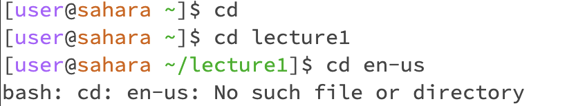
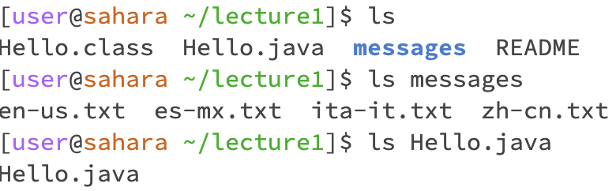
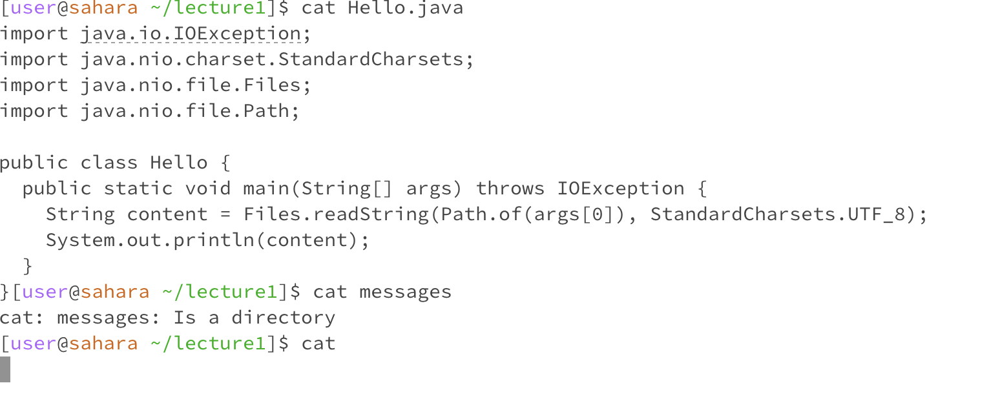

# Lab Report 1

## cd examples

* The purpose of the cd terminal command is to move the user to different directores
* The working directory is /lecture1, because that is where all of the commands can be ran. The only thing before this working directory is the home directory

## ls examples

* The purpose of the ls terminal command is to list the files of a directory and show them to the user
* The working directory is /lecture1, because that is where all of the commands can be ran. The only thing before this working directory is the home directory

## cat examples

* The purpose of the cat command is to concatenate the data in a file and print them out in terminal for the user to see what is in the file
* The working directory is /lecture1, because that is where all of the commands can be ran. The only thing before this working directory is the home directory
