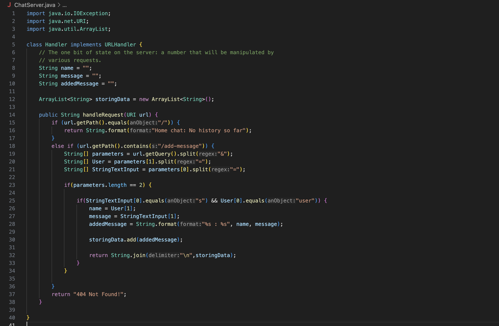
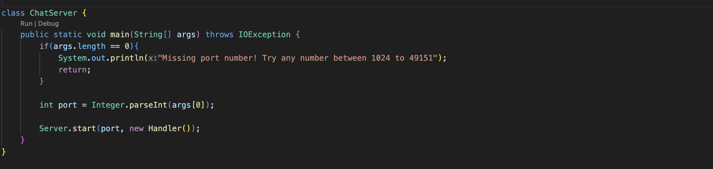
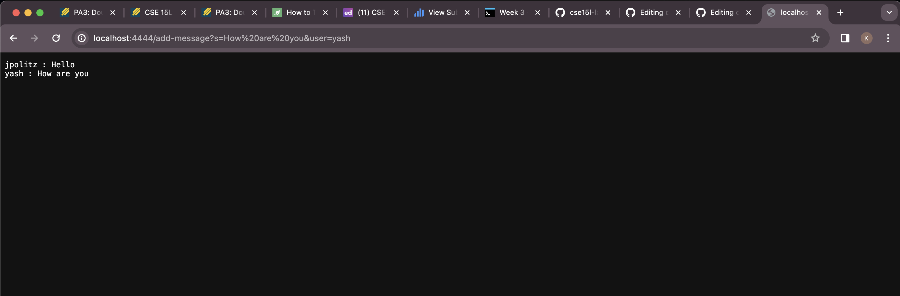

# Lab Report 2
By Kinish Sathish

## Part 1
Code Screenshots

* The methods called in my code are the `handleRequest` method which returns a string inside the `Handler` Class and the main method inside the `ChatServer` class.
* Method inside the `handleRequest` include `getQuery()`,`split()`,`length`,`contains()`
* The relevant arguments for each class are the URL that we input into localhost for the `Handler` Class, and the arguments passed into the main method such as the port local host is using, the message one wants to say and the user who is saying the message
* The only value that changes in the code would be the ArrayList `storingData`, this is because as we try to save multiple messages by changing the URL when using the localhost URL, the Arraylist increases in size with new values and as such changes. 

LocalHost Screenshot

* The methods called in my code are the `handleRequest` method which returns a string inside the `Handler` Class and the main method inside the `ChatServer` class.
* Method inside the `handleRequest` include `getQuery()`,`split()`,`length`,`contains()`
* The relevant arguments for each class are the URL that we input into localhost for the `Handler` Class, and the arguments passed into the main method such as the port local host is using, the message one wants to say and the user who is saying the message
* The only value that changes in the code would be the ArrayList `storingData`, this is because as we try to save multiple messages by changing the URL when using the localhost URL, the Arraylist increases in size with new values and as such changes. 

## Part 2
Private Key Path

Public Key Path

.png)

Terminal Work
.png)

## Part 3

Some things I learned over the past few weeks relate to how URL's work and are formatted, and how to update URL's to be able to access multiple different displays of data. I also learned about how to connect to public servers using Java ssh in terminals , and how Ports work in accessing multiple computers. I improved my understanding of directories, files, and the multiple ways in order to access files and see what is inside of them and to search for files and to update them.

