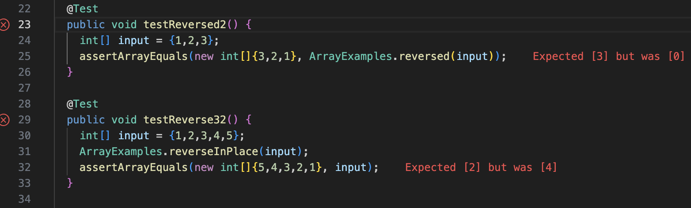
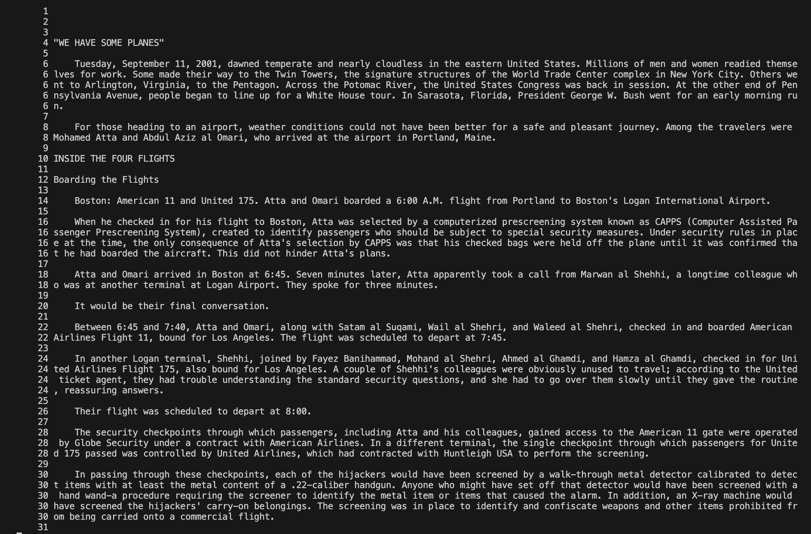
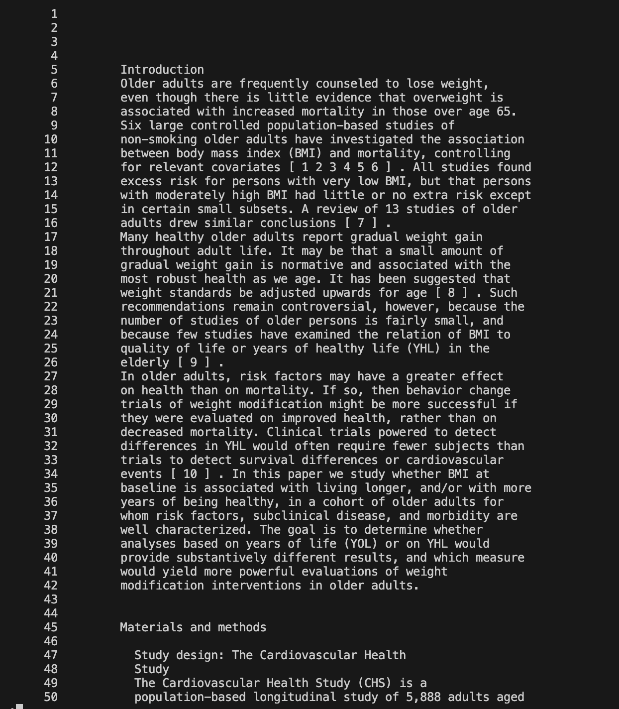
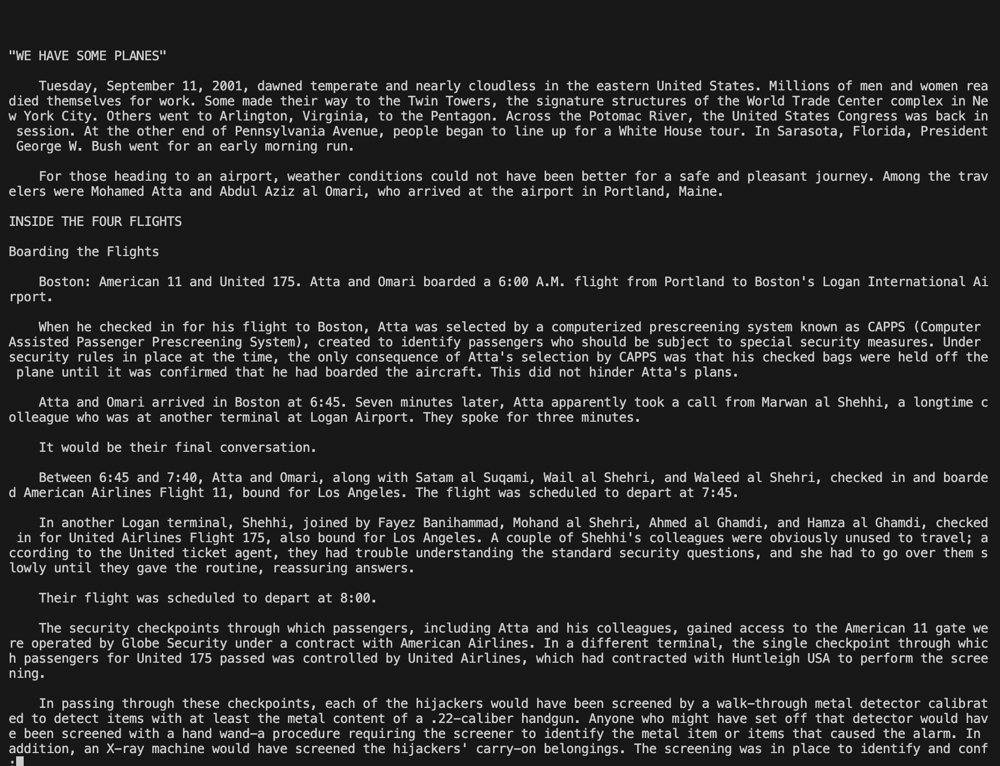
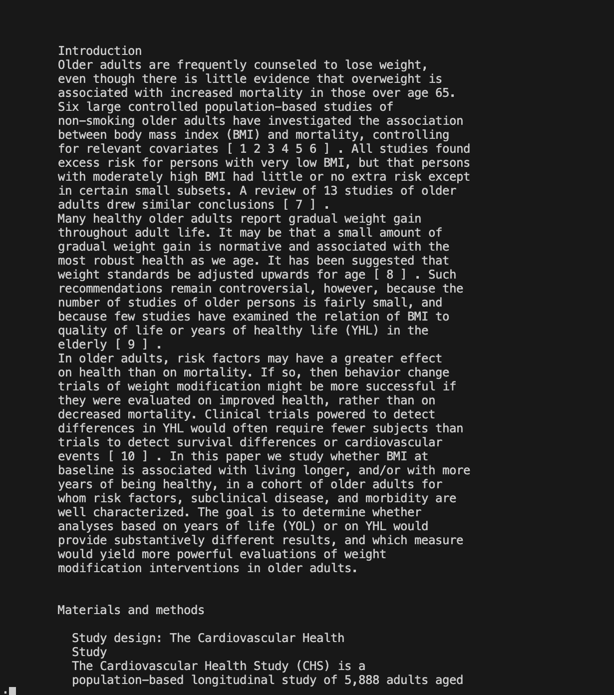
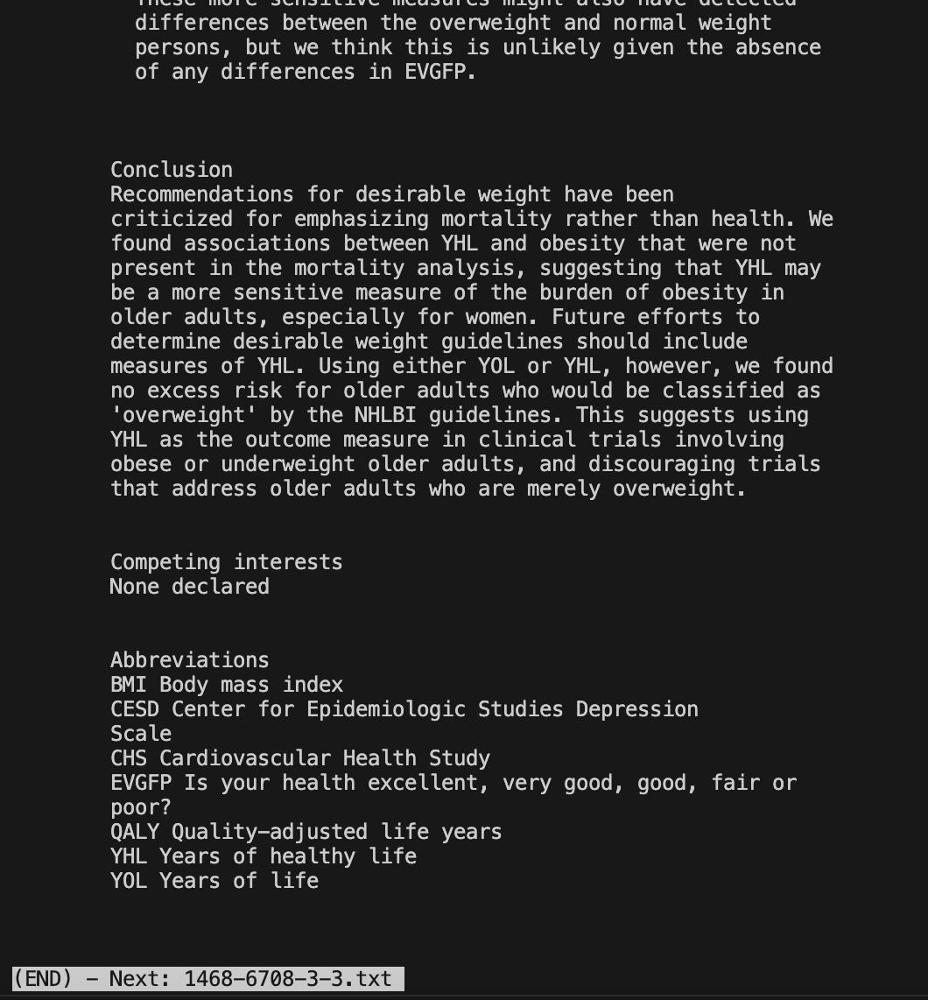
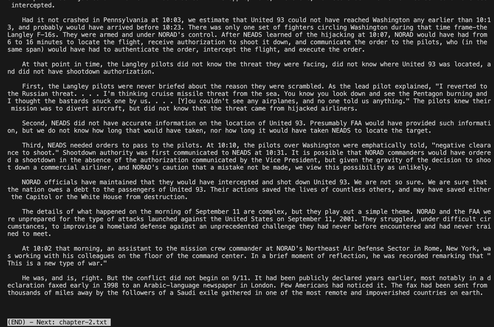
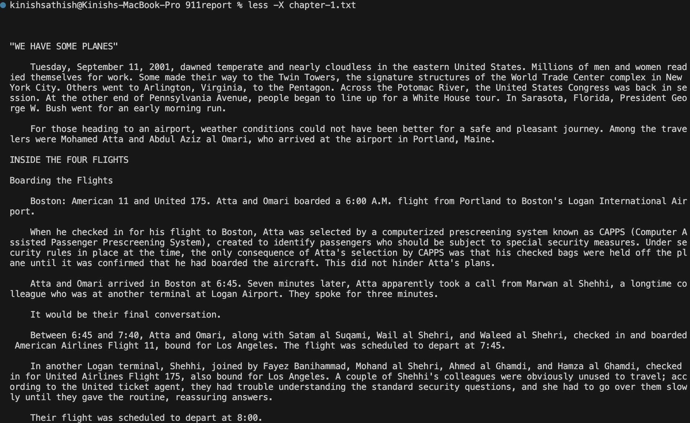
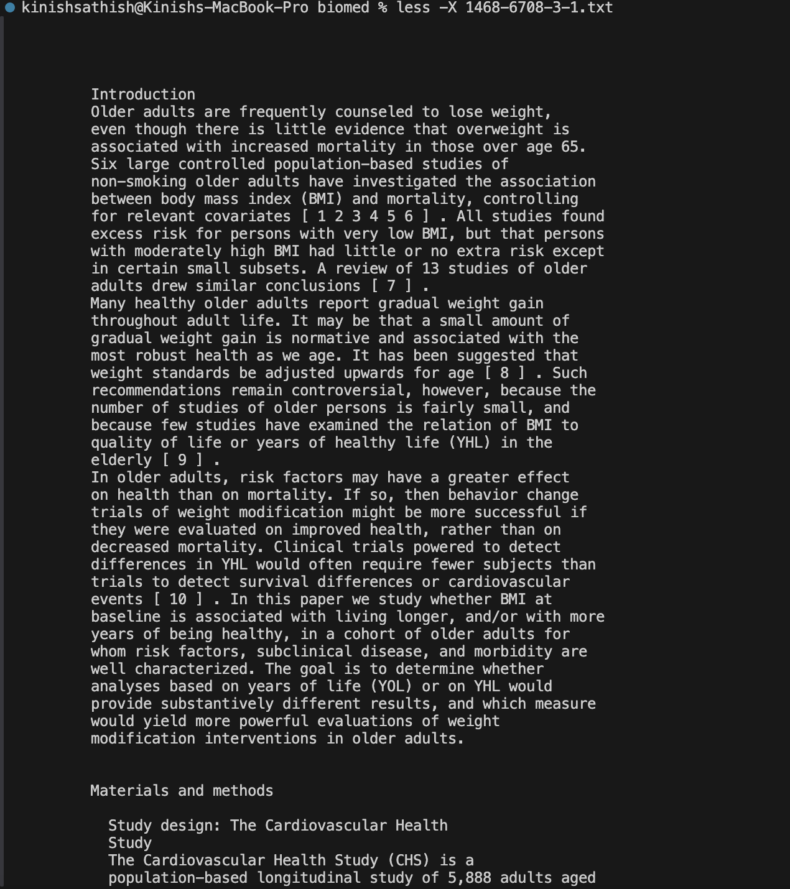

# Lab Report 2
By Kinish Sathish

## Part 1
The bug/errer which I choose is the bug within the `reversed` method from Lab 3


1) A failure inducing input for the buggy program would be an array with different values (ex [1,2,3,4,5]) as the code in the `reversed` method only modifies the existing elements in the current array
   without returning a new one
2) A non-failiure inducing output for the buggy program would be an array with an odd number of indexes, and with all the index values being the same.
3)


4) Old Version:
```
{
 static int[] reversed(int[] arr) {
    int[] newArray = new int[arr.length];
    for(int i = 0; i < arr.length; i += 1) {
      arr[i] = newArray[arr.length - i - 1];
    }
    return arr;
  }
}
```
New Version:
```
{
 static int[] reversed(int[] arr) {
    int[] newArray = new int[arr.length];
    for(int i = 0; i < arr.length; i += 1) {
      newArray[i] = arr[arr.length - i - 1];
    }

    return newArray;

  }
```
The fix addresses the issue, because it makes sure that array `newArray` actually stores the values of array `arr` in reverse, instead of trying to alternate `arr` with the values of `newArray` 
whos values have not even been initialized in the old version code block.

## Part 2
The command that we are going to delve deeper into research will be the less command, which in general is used to look at the contents/outputs of files.

Examples 1 
Comand 1: 
Output 1: 

Command 2:
Output 2: 

The function of the -N command in the less command is to generate numbered lines for each file for better reading and organization. Useful to help access each line individually. 

Examples 2
Comand 1: 
Output 1: 

Comand 1: 
Output 1: 

The function of the -s command in the less command is to generate the contents/outputs of the files without any or less amounts of spaces inbetween lines. Useful for saving terminal space

Example 3
Comand 1: 
Output 1: 

Comand 1: 
Output 1: 

The function of generating the contents/outputs of many files is used in this case, useful for getting multiple outputs for multiple files

Example 4
Comand and OutPut 1: 
Comand and OutPut 2: 

The function -X is useful for saving the contents of a file into the terminal. Useful in case the user decides to exit terminal, because contents/output are saved

Source: https://phoenixnap.com/kb/less-command-in-linux 


